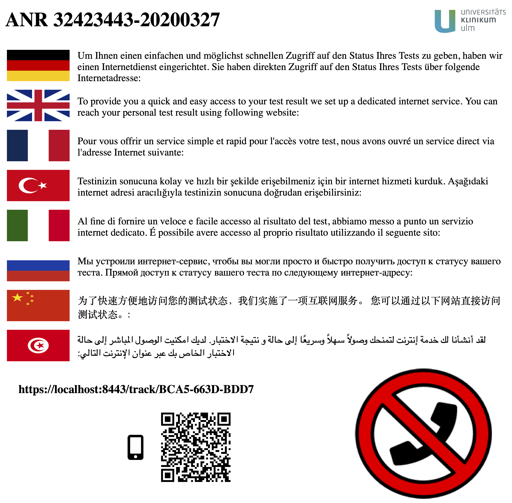
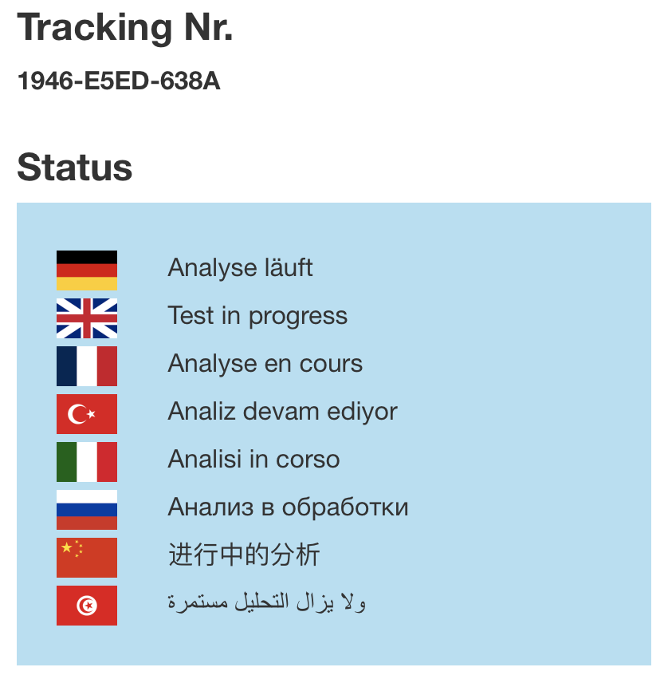
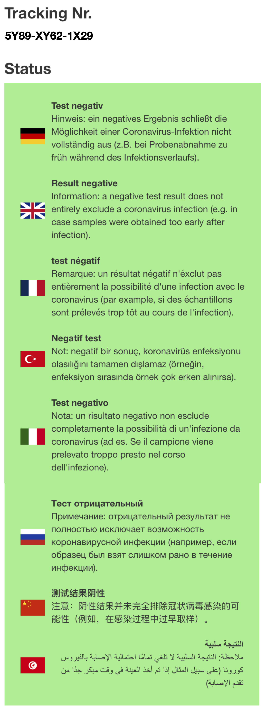

# CTest: an online system to track COVID-19 test results

This is an online tracking system for COVID-19 tests. CTest provides a browser-based online status update for testees using personalized QR-codes (and web links). CTest does not require installation of any apps or logins for users. Instead, CTest uses cryptographically secure tracking IDs and does not use any personal data.
The primary aim of this approach was to reduce the burden of clinical staff in the COVID-19 crisis and to allow efficient and almost instantaneous communication of the results to testees. Speedy communication is of the essence in the current crisis, as it virus carriers can be infectious before first symptoms arise.


## Table of Contents
   
  * [Getting Started](#getting-started)
     * [Prerequisites](#prerequisites)
     * [Initialisation and Startup](#initialisation-and-startup)
  * [Configuration](#configuration)
     * [General Settings](#general-settings)
     * [Server Settings for CTest](#server-settings-for-ctest)
     * [Order numbers &amp; Import](#order-numbers--import)
     * [Backup](#backup)
     * [Branding](#branding)
     * [CTest server setups with Apache as proxy](#ctest-server-setups-with-apache-as-proxy)
     * [Protection from Brute-Force Attacks](#protection-from-brute-force-attacks)            
  * [Using CTest](#using-ctest)
     * [Administration](#administration)
     * [User](#user)
     * [If something went wrong](#if-something-went-wrong)
     * [Testee](#testee)
     * [App integration](#app-integration)
  * [Build](#build)
  * [Built With](#built-with)
  * [Authors](#authors)
  * [License](#license)
  * [Acknowledgments](#acknowledgments)
  * [Cite](#cite)


## Getting Started

These instructions will explain you how to setup a local CTest instance on your computer for testing purposes. 

Download a release version of CTest: 

* [Version 0.2.2](https://github.com/sysbio-bioinf/CTest/releases/download/0.2.2/ctest-0.2.2.jar)


### Prerequisites

CTest has been tested with **Java 8**.

CTest should be run with Transport Layer Security (TLS).
Typically, you will run CTest behind an existing web server (apache, nginx,...) that already provides TLS.

For testing purposes the keystore `keystore.jks` in the project repository has been generated as follows:

``` shell
$ keytool -genkey -keyalg RSA -alias selfsigned -keystore keystore.jks -storepass password -validity 365 -keysize 2048
```
*A self-signed certificate has the disadvantage that the users are warned by their web browsers that their connection is not secure. Hence, this should only be used for test setups.*

### Initialisation and Startup

CTest is initialised via `java -jar ctest-<version>.jar init` which allows the following parameters:

``` shell
$ java -jar ctest-<version>.jar init -h
Initialise the CTest instance.

  -a, --admin NAME           admin_user       Name of the admin user
  -p, --password SECRET      secret_password  Admins password
  -d, --data-base-name NAME  ctest.db         Name of the database. CTest will not override a existing database file.
  -h, --help
```

`--admin`
 : login name of the admin account

`--password`
 : password of the admin account

`--data-base-name`
 : filename of the CTest database to create (existing databases are not overridden)

The `init` call will create the CTest database with the default or specified administrator user and a default configuration file.
The configuration file should be adjusted to the concrete usage scenario.

After the initialisation CTest can be started as follows:

``` shell
$ java -jar ctest-<version>.jar run
CTest started - Server listening on:
http://localhost:8000
https://localhost:8443
```

The default configuration will start CTest only on the localhost -- to be able to access the server remotely the server settings need to be adjusted.

To use different configuration files, you can specify the configuration to use as follows:

``` shell
$ java -jar ctest-<version>.jar run -c another-ctest.conf
```

## Configuration

The CTest configuration file allows customisation for different setup scenarios.
The configuration file contains a Clojure map to specify the various settings.
Consider the following short excerpt from the default configuration:

``` clojure
{:server-config
 {:host "localhost",
  :port 8000},

 :data-base-name "ctest.db"
 ... }
```

Each map is started by `{` and ended by `}`.
Settings are specified as pairs of keyword and value, e.g. keywords such as `:port` followed by a value such as `8000`.
Keywords also identify configuration for subcomponents of CTest, e.g. the server configuration `:server-config`.


### General Settings

CTest offers the following general settings for customisation:

``` clojure
{ ...
 :data-base-name "/installpath/ctest/ctest.db"
 
 :log-level :info,
 :log-file "ctest.log",

 ... }
```

The effect of these settings is described in the following.

`:data-base-name`
 : path to the database that CTest uses to store all user account and tracking data.

`:log-level`
 : specifies how much information is written into the log file. Possible values: `:trace`, `:debug`, `:info`, `:warn`, `:error`, `:fatal`

`:log-file`
 : path to the log file.


### Server Settings for CTest

CTest ships with a built-in web server ([Jetty](http://www.eclipse.org/jetty/)).

The following listing shows the relevant server settings.
Other settings together with a short description can be found in the [ring library documentation](https://ring-clojure.github.io/ring/ring.adapter.jetty.html).

``` clojure
{:server-config
 {:host "localhost",
  :port 8000,
  :server-root "",

  :proxy-url nil,
  :forwarded? false,

  :ssl? true,
  :ssl-port 8443,
  :keystore "keystore.jks",
  :key-password "password"},
 ... }
```

The server settings are located in the `:server-config`.
The following properties are used:

`:host`
 : specifies the network interface to which the web server binds.
   The host is also used for the generation of links to CTest pages.
   Use `"localhost"` for access from the local computer.
   Use the full qunatified domain name or IP of the network interface that connects to the internet for remote access.

`:port`
 : specifies the port on which the web server will listen.

`:server-root`
 : specifies the prefix path under which the CTest server pages are available, e.g. `"ctest"` when CTest is run at `your.domain.tld/ctest`

`:proxy-url`
 : When CTest is used behind a proxy, you need to specify the URL under which CTest is accessible at the proxy.

`:forwarded?`
 : When CTest is used behind a proxy, you need to set this to `true`. Otherwise, keep `false`.

`:ssl?`
 : enables or disables transport encryption (aka "https").

`:ssl-port`
 : specifies the port used for encrypted communication.

`:keystore`
 : specified the filename of the keystore that contains the certificate for the transport encryption.

`:key-password`
 : specifies the password needed to access the keystore (if any).


### Order numbers & Import

The format of **order numbers** needs to be specified by a regular expression.
In some scenarios the uniqueness of order numbers can only be guaranteed for the same day.
Therefore, you can specify `:append-date? true` such that CTest constructs order numbers 
from the given numbers `XXXXXXXX` by appending the current date resulting in `XXXXXXXX-YYYYMMDD`.
If this is not required, specify `:append-date? false`.
A configuration that appends dates may look as follows:
``` clojure
:order-numbers {:input-format "[0-9]{8,8}"
                :append-date? true
                :new-patient-hint "Order Number"
                :new-patient-note "Note: Order Number must be an eight digit number."
                :find-patient-hint "XXXXXXXX-YYYYMMDD"
                :find-patient-note "Note: Order Number must be an eight digit number combined with eight digit date separated by a hyphen."}
```
Hints about valid order numbers for new patients and patient identifiers to find patients in the web front end 
can be configured using ```new-patient-hint``` and ```new-patient-note``` as well as ```find-patient-hint``` and ```find-patient-note```.

You have to specify the format of the CSV files and the location (`:path`) where CTest can find them:
``` clojure
:import {:path "/path/to/import/folder"
         :order-number-column "auftragsn"
         :date-column "abnahme"
         :date-format "dd.MM.yyyy"
         :result-column "ergebnis"
         :negative-result "ungr"
         :column-separator ";"}
```

CTest will keep watching the specified `:path` for new csv files.
When no dates are appended to the order numbers, two columns are required:

1. the column containing the order number (`:order-number-column`).
2. the column containing the result of the test (`:result-column`).

In case dates are appended to the order numbers, a third column (`:date-column`) is needed containing
the date of sample collection (the same date the patient was entered into CTest).
Furthermore, the date format needs to be specified (`:date-format`) 
with placeholders `d` for day digit, `M` for month digit and `y` for year digit (see [Javadocs](https://docs.oracle.com/javase/8/docs/api/index.html?overview-summary.html)).

You have to specify the correct `:column-separator` that is used in the CSV files.


### Backup

CTest performs a backup on startup and with the default configuration 
hourly backups every half an hour.
You can adjust the settings in the configuration file:

``` clojure
:backup {:path "/safestorage/ctest/backup"
         :start-minute 30
         :interval 60}
```

`:path`
 : path to the directory where the project stores backups from the database.
 
`interval` 
 : interval between two consecutive backups.
 
`:start-minute`
 : the minute of an hour when the first backup shall be performed (relative to the start of CTest).

If the configuration does not contain a `:backup` entry, CTest will not do any backup.


### Branding

You can customize your instance of CTest by modifying the following parameters in the configuration file ```ctest.conf```:

``` clojure
:branding {:path "storage/branding"
           :page-logo "logo.png"
           :patient-document-logo "pat_logo.png"
           :page-title "Corona Virus Information",
           :page-title-link "http://your.hospital.org/corona"}
```
First, specify the ```path```, where your logo images are stored. 
The parameters ```page-logo```and ```patient-document-logo``` determine the filenames of the logo 
that is shown on top of the page and the one that is included in the patient printouts. 
```page title```and ```page title link``` can be used as header and link to your organization unit.


### CTest server setups with Apache as proxy

This section explains a fully featured setup on a Linux server with automatic startup of CTest when the server is rebooted.
There are two setup scenarios for CTest:

1. CTest standalone
2. CTest behind proxy

*A similar setup is possible on windows servers as well, though the means to achieve it are different.*

#### Automatic Startup of CTest

CTest can be installed as a daemon on Linux via using the init script [ctest](https://raw.githubusercontent.com/sysbio-bioinf/ctest/master/tools/ctest) (root privileges on the server are required).
Modify the settings in the init script appropriately and copy it to `/etc/init.d/`.
The settings section of the init script looks as follows:

``` shell
## CTest settings

VERSION="<version>"
INSTALL_DIR="/home/youruser/ctest"
CONFIG="ctest.conf"
OPTS=""

## Linux user and group for CTest process
RUN_AS_USER="ctest"
RUN_AS_GROUP="ctest"

## memory settings for the JVM
MIN_MEMORY="256M"
MAX_MEMORY="4096M"
```

Set the install directory `INSTALL_DIR` to the one where you copied the CTest jar file and initialised the database.
If you choose a different configuration name, you will have to adjust the variable `CONFIG` appropriately.
It is recommended to create a user account dedicated to run CTest.
In the example above a user account `ctest` with group `ctest` is used.
The minimal and maximal memory that is used by the JVM can be adjusted to your usage scenario.

After copying the init script `ctest` to `/etc/init.d/ctest` you can configure the automatic startup on server boot
via the operating system tools, e.g.  `rcconf`.
Manual start, stop and restart is possible via the following:

``` shell
/etc/init.d/ctest start
/etc/init.d/ctest stop
/etc/init.d/ctest restart
```
or
``` shell
service ctest start
service ctest stop
service ctest restart
```


##### CTest Standalone

For the standalone scenario only the init script needs to be setup as described in the Section [Automatic Startup](automatic-startup).
The `:server-config` in the configuration file should set the port to `80`, the ssl port to `443` and the domain name of your server as host.

``` clojure
{:server-config
 {:host "your.domain.tld",
  :port 80,
  :ssl? true,
  :ssl-port 443,
  ... },
 ... }
```


##### CTest behind Proxy

This section describes the CTest setup using [Apache](https://httpd.apache.org/) as proxy.
In the proxy scenario the transport encryption is provided by Apache such that transport encryption is disabled in CTest.
Therefore, the init script setup from Section [Automatic Startup](automatic-startup) should be performed in advance.

We describe two possibilities to use Apache as a proxy for CTest:

1. CTest as a subdomain of your domain (virtual host).
2. CTest as a subdirectory.


##### CTest as Subdomain

To setup CTest to use a subdomain of your domain (virtual host),
you need to have a virtual host definition in `/etc/apache2/sites-available/ctest` like the following:

``` apache
ProxyRequests Off
ProxyPreserveHost On

<VirtualHost *:80>
  ServerName ctest.your.domain.tld
  Redirect permanent / https://ctest.your.domain.tld/
</VirtualHost>


<VirtualHost *:443>
  ServerName ctest.your.domain.tld

  SSLEngine On
  SSLProxyEngine On
  SSLProxyVerify none
  SSLCertificateFile /path/to/certificate.crt
  SSLCertificateKeyFile /path/to/keyfile.key

  ProxyPass / http://localhost:CTEST-PORT/
  ProxyPassReverse / http://localhost:CTEST-PORT/
  RequestHeader set X-Forwarded-Proto "https"
  ErrorLog /var/log/apache2/ctest.log
  CustomLog /var/log/apache2/ctest.log common
</VirtualHost>
```

This sets up a a virtual host `ctest.your.domain.tld` on your domain `your.domain.tld` using transport encryption.
The virtual host is forwarded to the chosen port `CTEST-PORT` on `localhost` which CTest listens to.
The paths to the certificate file `/path/to/certificate.crt` and the certificate key file `/path/to/keyfile.key` 
must be filled in according to your server configuration.
The `:server-config` of the CTest configuration has to look like:

``` clojure
{:server-config
 {:host "localhost",
  :port CTEST-PORT,
  :server-root "",

  :proxy-url "ctest.your.domain.tld",
  :forwarded? true,

  :ssl? false},
 ... }
```

##### CTest as Subdirectory

To setup CTest to use a subdirectory of your domain, you need to add the following to your existing virtual host:

``` apache
<Location /ctest>
  ProxyPass        http://localhost:CTEST-PORT/ctest
  ProxyPassReverse http://localhost:CTEST-PORT/ctest
</Location>
```

You have to fill in `CTEST-PORT` with the port you specified in your CTest configuration file.
You also need to specify `ProxyRequests Off` and `ProxyPreserveHost On` before the existing virtual host, e.g.

``` apache
ProxyRequests Off
ProxyPreserveHost On

<VirtualHost *:443>
  ServerName your.domain.tld
  
  ...
  
  <Location /ctest>
    ProxyPass        http://localhost:CTEST-PORT/ctest
    ProxyPassReverse http://localhost:CTEST-PORT/ctest
  </Location>
</VirtualHost>
```

This sets up a directory `ctest` on your domain `your.domain.tld` such that CTest is accessible via `your.domain.tld/ctest`.
The directory `ctest` of the virtual host is forwarded to the chosen port `CTEST-PORT` on `localhost` which CTest listens to.
The `:server-config` of the CTest configuration has to look like:

``` clojure
{:server-config
 {:host "localhost",
  :port CTEST-PORT,
  :server-root "ctest",

  :proxy-url "your.domain.tld",
  :forwarded? true,

  :ssl? false},
 ... }
```

### Protection from Brute-Force Attacks

[Fail2Ban](https://github.com/fail2ban/fail2ban) can be used as a protection from
brute-force attacks on logins and tracking URLs.
The following instructions describe the setup of Fail2Ban for CTest on a Linux server.
The configuration consist of at least 3 files:
 * [`filter.d/ctest.conf`](tools/fail2ban/filter.d/ctest.conf): 
   defines the filter to detect failed login attempts
 * [`filter.d/ctest-tracking.conf`](tools/fail2ban/filter.d/ctest-trackig.conf): 
   defines the filter to detect tracking URL guessing/enumeration attempts
 * [`jail.local`](tools/fail2ban/jail.local):
   defines the rules for banning IPs due to brute-force attacks on logins or tracking URLs
  
A fourth file is required, when you are using a reverse proxy that is running on a different server
than CTest:
 * [`action.d/iptables-reverse-proxy.conf`](tools/fail2ban/action.d/iptables-reverse-proxy.conf):
   defines the actions to ban and unban the source IPs (`X-Forwarded-For:`)
   instead of the proxy IP
   
Apart from `jail.local`, you can just copy the files to the configuration directory of Fail2Ban
`/etc/fail2ban`. If you already use Fail2Ban, you will have to merge our `jail.local` with your current `jail.local`.

There are a few parameters that you can adjust to your needs in `jail.local`, 
e.g. for preventing login brute-force attacks:
```
[ctest]

enabled  = true
#ignoreip = whitelisted ips
port     = 80
protocol = tcp
filter   = ctest
logpath  = /opt/ctest/ctest.log
maxretry = 3
bantime  = 180
findtime = 180
banaction = iptables-reverse-proxy[name = ctest, port = http, protocol = tcp]
```

* `logpath` specifies where the CTest log file is located.
* `banaction` only needs to be specified when the proxy is on a different server than CTest.
* `maxretry` specifies the number of failed logins until the IP is banned (here: 3).
* `bantime` specifies the ban duration in seconds (here: 3 minutes).
* `findtime` specifies which failed attempts count for a ban. 
  In this case failed attempts that are longer ago than 3 minutes do not count anymore.
* `port` needs to be adjusted when you use a different one.

After everything is setup, reload Fail2Ban via `fail2ban-client reload`.

## Using CTest

### Administration

CTest can be accessed in two different roles:

1. Administrator
2. User 

The administrator accounts serve only for creating new accounts (users, administrators and reporters).
An initial administrator account is created on initialisation of CTest.
The user accounts are used by staff members to enter new test tracking entries
or search for existing ones by their order number.

Apart from that, there is a third *Reporter* role for monitoring.

#### Reporting

A *Reporter* account has access to the reporting functionality of CTest
and can inspect problems in the running CTest instance.
All results are returned in the machine-readable JSON format.

The following queries can be performed:

1. GET `/reports/list` to get the list of reports logged by CTest.
   The reports are either informations (`info`), warnings (`warn`) or errors (`error`). 
   It is possible to filter the report list by the following two parameters:
 
    * `type` must exactly match `error`, `warn` or `info`.
    * `context` specifies a search string that matches all reports whose context contains this string.

2. POST `/reports/delete` to delete the specified reports.
   The ids of the reports need to be passed in JSON format as the body of the request, e.g.
   ```json
   {"report-ids": [2, 3, 7]}
   ```
    
3. GET `/reports/views` to get the total views of tracking pages per day.

4. GET `/reports/test-dates` to get the list of test dates for further statistical analysis.

5. GET `/reports/system` to get information about the current memory consumption and CPU usage.

### User

#### Adding new test tracks
Staff members can login with their user account via `ctest.your.domain.tld/staff`. 
After login, staff members can create new patient tracking entries by selecting "New Patient" in the menu bar. 

Entering a certain order number (e.g. specified by the test laboratory) a new tracking entry can be added to the system. 
Either the order number combined with the current date (`:append-date true`) or the plain order number are used to identify the patient.
A unique tracking ID is generated for the patient using a cryptographically strong random number generator.
The tracking ID is a string with 12 characters from the sets '0-9' and 'A-F' in the following format : *XXXX-XXXX-XXXX*. 
This tracking ID can be used by testees to access their test status. 
Therefore, a testee-specific html is generated which contains a testee-specific URL and a QR code that encodes this URL. 
A printer dialog is opened automatically to provide testees with a printout such as the following:



Currently - according to German regulations - the testee can see one of two different statuses (see following screenshots) :

**1. Test in progress**
 

**2. Test negative**
 


In Germany, positively tested people are called by the respective health department.

All html-files are included in the repository and adaptable to specific needs.

### If something went wrong

Please double-check the entered order number, as it links the testee's tracking ID with the corresponding order number.
However, if a wrong order number was entered, it can be changed on the page following on 'Create Patient'.

### Testee

Testees can either type in the specific tracking URL from their information sheet or scan the QR-Code to access their current test status. 
Alternatively, it is possible to enter the tracking-ID in the correspoding text field on`ctest.your.domain.tld/track` (see following image).


No login of any kind is required for these actions!

### App integration

CTest facilitates the access of third-party software (apps), 
if the testee decide to use these.
The apps can query the status using the tracking link with appended `?app=true`.
This returns only the test status "negative" or "in progress" instead of the complete HTML document.


## Build

To build a standalone executable jar file, you need to [install Leiningen](https://leiningen.org/#install).
Then run the following:
```bash
lein do clean, uberjar
```
The resulting jar file can be found at `target/ctest-X.Y.Z.jar`.

## Built With

* [Cursive](https://cursive-ide.com/)
* [IntelliJ IDEA](https://www.jetbrains.com/de-de/idea/)
* [Leiningen](https://leiningen.org/)
* [Atom](https://atom.io/)
* [bootstrap](https://getbootstrap.com/)
* [jQuery](https://jquery.com/)


## Authors

Gunnar Völkel (1,¶), Axel Fürstberger (1,¶), Julian D. Schwab (1,¶), Silke D. Kühlwein (1,¶), Thomas Gscheidmeier (2), Johann M. Kraus (1), Alexander Groß (1), Peter Kuhn (3), Oliver Kohlbacher (4), Thomas Seufferlein (5,\*), Hans A. Kestler (1,\*)

1 Institute of Medical Systems Biology, Ulm University <br>
2 Department of Clinical Chemistry, University Hospital Ulm <br>
3 Comprehensive Cancer Center, University Hospital Ulm <br>
4 Institute for Translational Bioinformatics, University Hospital Tübingen <br>
5 Internal Medicine I, University Hospital Ulm

¶ equal contribution <br>
\* senior authors

## License

Copyright © 2020 Gunnar Völkel, Julian D. Schwab, Axel Fürstberger, Silke D. Kühlwein

CTest is based on [TraqBio](https://github.com/sysbio-bioinf/TraqBio) written by Fabian Schneider and Gunnar Völkel.

This project is licensed under the Eclipse Public License v2.0 (EPL-2.0).

## Acknowledgments

We thank the COVID-19 task force of the University Hospital Ulm, Udo X. Kaisers, CEO of the University Hospital Ulm, the Department of Clinical Chemistry, the Comprehensive Cancer Center Ulm, the ZIK and all our supporters at University Medicine Ulm (Martin Loose, Thomas Baur, Franz Jobst, Robert Mahnke, and others), who supported the development of the tool and allowed its fast integration into the clinical processes. We also thank Nensi Ikonomi, Yessin Yahia, William Ferdinand, Cagatay Günes, and Xenia Kirgis for their help translating the texts. The rapid implementation, deployment and integration was also made possible by support from different digitization initiatives. HAK and OK acknowledge, funding from the Germany Federal Ministry of Education and Research (BMBF) as part of the DIFUTURE project (Medical Informatics Initiative, grant numbers 01ZZ1804I and 01ZZ1804D). OK and HAK acknowledge funding from the Ministry of Science and Art Baden-Württemberg (Zentrum für Innovative Versorgung, ZIV). OK, PK and TS acknowledge funding from the Ministry of Social Affairs of the state of Baden-Württemberg (Zentren für Personalisierte Medizin, ZPM), HAK also acknowledges funding from the German Science Foundation (DFG, grant number 217328187).

## Cite

If you are using this software please cite.... ***UPCOMING***

